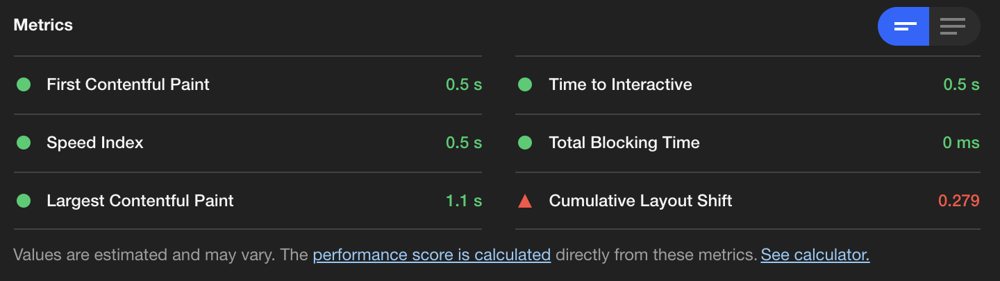

# Crisp - ECommerce Web Portal

Product Section of an ECommerce Web Portal constructed by a team of devs in accordance to a 27 page business requirements document as well as UX design patterns to meet the standards of a major clothing retailer.

This front-end project was engineered using React Hook base framework coupled with Redux and Redux hooks for global state management of key variables.  Sass was utilized for styling to enable a consistent theme across components built by different developers.  Finally, the application is rendered using an Express server along with the Axios library to retrieve data from a headless API.

---

## Application Overview

### Product Overview
>Main focus of the product page contains a interactive image gallery with scroll buttons and synchronized thumbnails for easy navigation, a product overview panel that includes style selection, and product description and details.


### Ratings & Reviews
>The Ratings & Reviews section will allow viewing and submission of reviews for the product selected. This component will extend the ability to write, read, and browse through reviews for the current product. All reviews will be saved per product.


---
## Table of Contents
1. [Installing Dependencies](#Installing-Dependencies)
2. [Tech Stack](#Tech-Stack)
3. [Optimization](#Optimization)
5. [Dev Team](#Contributers)

---

## Installing-Dependencies

### Run the following commands in your terminal in the root directory:

>*Install Dependencies*
```
npm install
```
>*Run Webpack Production Build*
```
npm run build-prod
```
>*Start the Server*
```
npm start
```
>*Alternatively, Run Webpack Development*
```
npm run build-dev
```

----

## Tech-Stack
- React + Hooks
- Redux + Hooks
- Sass
- Axios
- NodeJS
- Express

---

## Optimization Utilizing Google Lighthouse

Increased performance score to 95 from 34, First Contentful Paint to 0.5s from 5.1s, and Time to Interactive to 0.5s from 5.4s.  Methods utilized were eliminating unused code, moving Google Fonts from Bundle.js to direct link in HTML, incorporation of an NPM compression module, and switching Webpack to production mode to optimize Bundle.js size.




---

## Dev Team

### Matt Engel @github.com/mengel142
### Nuri Kim @github.com/nurigk